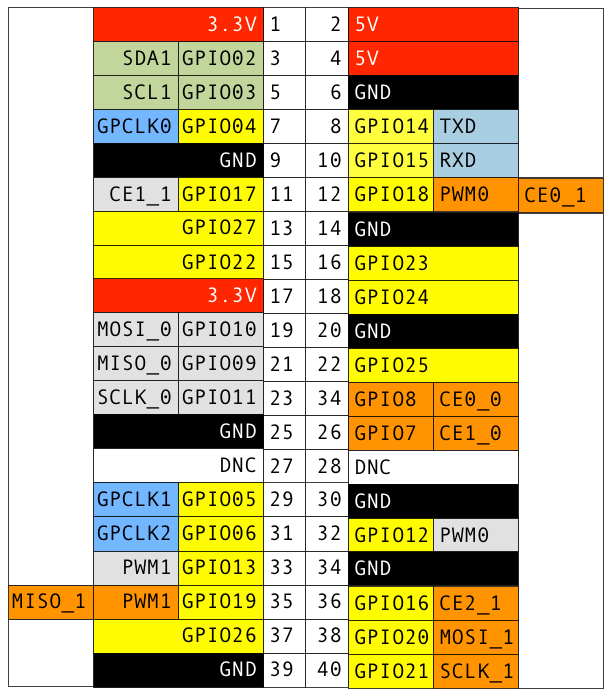

# J8 ピンヘッダレイアウト

* Raspberry Pi Zero
* Raspberry Pi 3
* Raspberry Pi 2 A+, B+
* Raspberry Pi A+, B+

## Raspbeery Pi A, B

新しいモデルのRaspberry Piと比べて、初期モデルは以下の違いがある。

Revision 2.0
* 26ピンまで

Revision 1.0
* 26ピンまで
* GPIO02 が GPIO00
* GPIO03 が GPIO01
* GPIO27 が GPIO21
