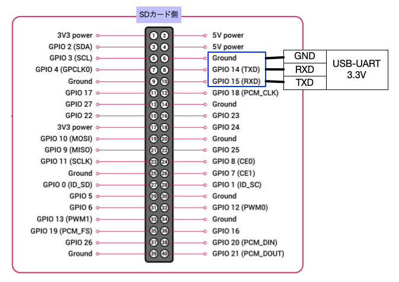

# ヘッドレスセットアップ

## Raspberry Pi OSの初期起動でユーザを作成する

1. ダウンロードしたRaspberry Pi OSを用意する
2. [gnerate-userconf.sh](./generate-userconf.sh) の NEW_USERNAME, NEW_PASSWORDを書き換えて実行する(要Docker)
3. 表示された `-- /boot/userconf.txt` の次の行を bootパーティションに userconf.txt として保存する
4. /boot/config.txt の末尾に `dtoverlay=pi3-miniuart-bt` を追記する
5. /boot/ssh という空ファイルを置くと、sshを有効にできる
6. シリアルケーブルを接続して起動する

# 参考
* [GPIO and the 40-pin Header](https://www.raspberrypi.com/documentation/computers/raspberry-pi.html)
* [An update to Raspberry Pi OS Bullseye](https://www.raspberrypi.com/news/raspberry-pi-bullseye-update-april-2022/)
* [piユーザーが削除されたRaspberry Pi OSと公式ヘッドレスセットアップのやり方研究](https://akkiesoft.hatenablog.jp/entry/20220409/1649471075)
* [シリアルコンソール便利っすよ](https://blog.mame.moe/2020/12/blog-post.html)
